<div align="center">

<picture>
  <source media="(prefers-color-scheme: dark)" srcset="docs/media/banner-dark.png">
  
</picture>

**Weight budgeting for combat robots.** MakeWeight slices your printed parts for real with Bambu Studio, keeps a weight
sheet for every robot, learns from your scale, and finds the print profiles that get the whole robot under its class
limit — then hands Bambu Studio a project with every part on its own plate.

[](https://github.com/13djwright/MakeWeight/releases/latest)
[](https://github.com/13djwright/MakeWeight/releases)
[](LICENSE)


[Install](#install) · [A tour](#a-tour) · [How the numbers work](#how-the-numbers-work) · [Export to Bambu Studio](#export-to-bambu-studio) · [Two computers](#using-it-on-more-than-one-computer) · [FAQ](#faq)

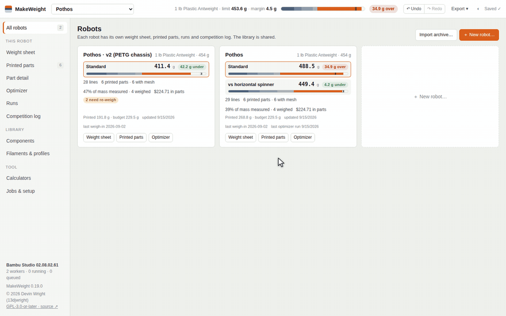

</div>

## Why

Every combat-robot builder has a spreadsheet of guessed part weights, and every one of them has been surprised on the
competition scale. MakeWeight replaces the guesses: each printed part's estimate is what the slicer actually says for
that mesh, that profile and that filament, re-sliced whenever any of them change. Your scale still wins where you have
weighed something — and every weigh-in teaches the app how far your filament runs from the slicer, so the remaining
estimates get better. When the sheet says you are over, the optimizer searches walls, shells and infill per part and
shows only plans it has re-sliced for real.

## Install

**macOS / Linux** — paste into Terminal:

```sh
curl -fsSL https://raw.githubusercontent.com/13djwright/MakeWeight/main/install.sh | sh
```

**Windows** — paste into PowerShell:

```powershell
irm https://raw.githubusercontent.com/13djwright/MakeWeight/main/install.ps1 | iex
```

Both download the latest release for your machine, unpack it (`~/Applications/MakeWeight`, `~/.local/opt/makeweight`,
`%LOCALAPPDATA%\Programs\MakeWeight`) and start it in your browser. Installed this way there is no macOS "unidentified
developer" prompt and no SmartScreen warning, because the files never pass through the browser's quarantine.

On first run open **Jobs & setup → Install Bambu Studio**. MakeWeight downloads Bambu Studio into its own data folder
and drives it headlessly; nothing is installed system-wide, and if you already have Bambu Studio or PrusaSlicer you can
point at that instead. Everything runs locally — your meshes never leave the computer.

<details>
<summary>Manual install and updating</summary>

You can also download a zip from the [Releases page](https://github.com/13djwright/MakeWeight/releases), unzip it
anywhere and start `MakeWeight.command` / `MakeWeight.bat` / `makeweight.sh` — macOS will then ask once per download
(System Settings → Privacy & Security → Open Anyway).

To update: **Jobs & setup → Check for updates → Update now**. The app downloads the new version itself, starts it and
hands over; your data stays in your user data folder (`~/Library/Application Support/MakeWeight`,
`%LOCALAPPDATA%\MakeWeight`, `~/.local/share/makeweight`) and is untouched. Older version folders are listed on that
page and are safe to delete.
</details>

## A tour

### Robots

Each robot has its own weight sheet, printed parts, optimizer runs and competition log; filaments, print profiles and the
component library are shared. The cards on the home page show at a glance whether each configuration of each robot
makes weight.

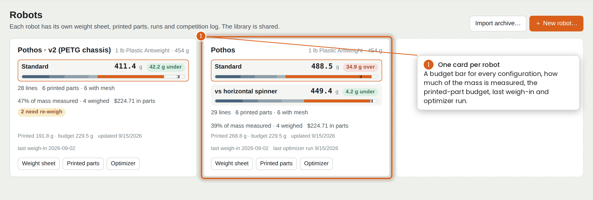

### The weight sheet

The sheet is where you live. Lines are grouped into sections (Drive, Electrical, Weapon, hardware, printed parts, spares
that do not count), each line has an estimate and — once you have put it on the scale — a measured weight, and the
budget bar at the top never leaves the screen.

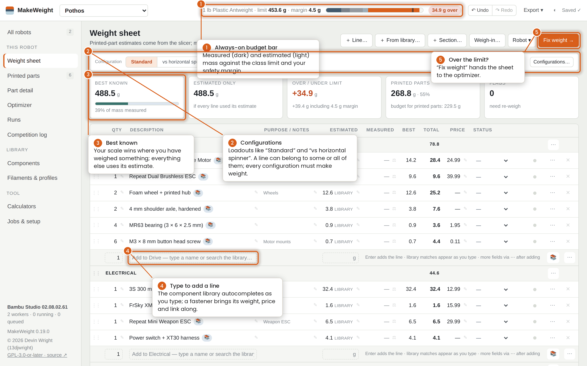

Printed parts on the sheet are not typed in — they are sliced. Configurations let one sheet describe several loadouts
(forks for most fights, a wedge against horizontal spinners) with every one of them checked against the limit.

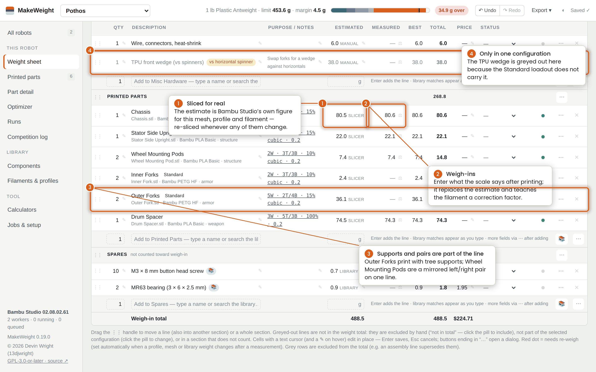

Type into the empty row at the bottom of any section to add a line. The component library autocompletes as you type, and
picking a library part links the line to it, so a weigh-in of that part on any robot updates every sheet that uses it.

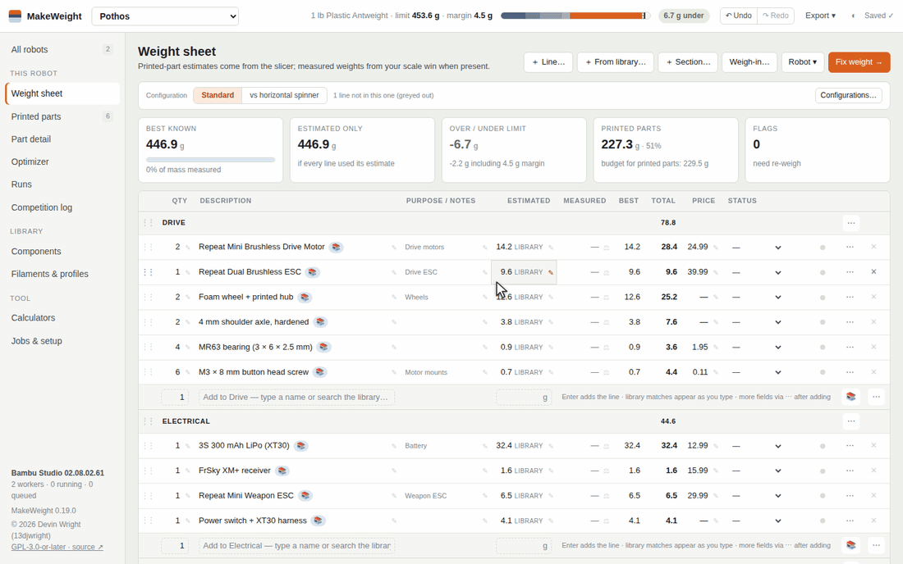

### Printed parts

Drop STL, OBJ, PLY or 3MF files on the Printed parts page — one file per part, or your whole robot exported as one file.
Every body goes through a dialog that guesses (by volume and size) whether it is a new part or a replacement for an
existing part's mesh; objects from a Bambu Studio or PrusaSlicer `.3mf` bring their own walls, infill and filament
settings along.

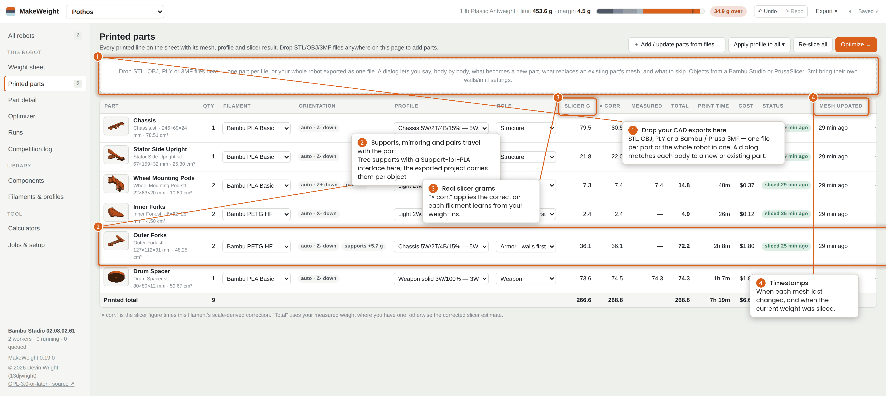

### Part detail

One page per part: orientation and a 3D preview, a layer view for sanity-checking, the filament and profile, print-prep
options that travel into the exported project, and a table of every slice ever run on that orientation so you can compare
profiles side by side.

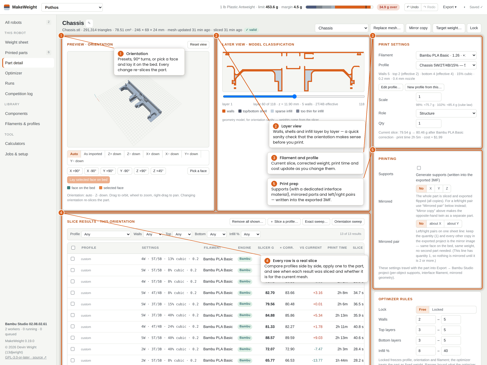

Replacing a mesh keeps the old one. **Mesh history** lists every version with its date, volume, size and the weight the
slicer gave it, and **Compare** overlays two versions — older in orange, newer in blue, where orange shows through material
was removed — or shows them side by side with linked cameras, with a table of the differences. Any version can be viewed,
downloaded as STL or restored.

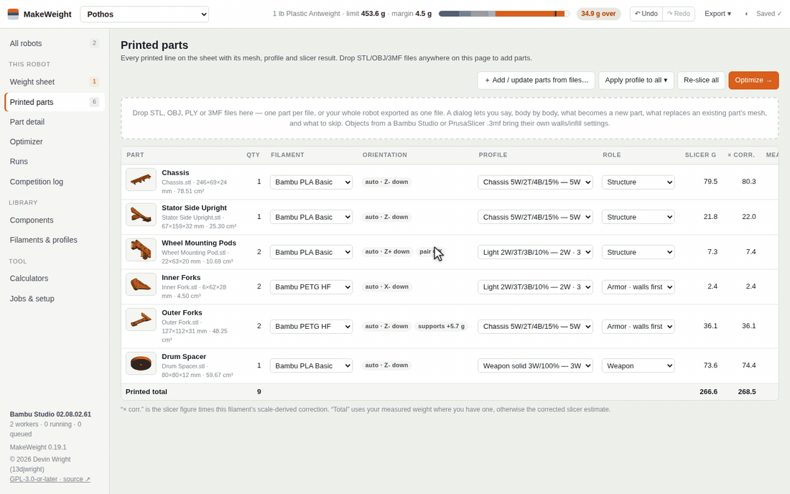

### The optimizer

When the sheet is over, **Fix weight →** opens the optimizer. Pick a strategy (the same settings for every part, per role,
fill the strongest parts first, or trim the current profiles), and it slices each free part at the corners of its allowed
walls / shells / infill ranges, fits a model of how weight moves with each setting, searches thousands of combinations,
and then re-slices every plan it shows for real. Robots with several configurations must make weight in all of them.

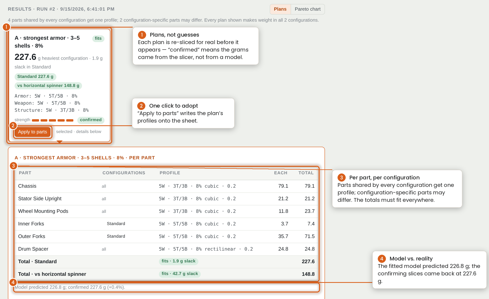

Every plan card states the heaviest configuration, the slack, the settings per role and whether the grams are confirmed.
**Apply to parts** writes the plan's profiles onto the sheet; lines you had already weighed are flagged for a re-weigh
because the print changed.

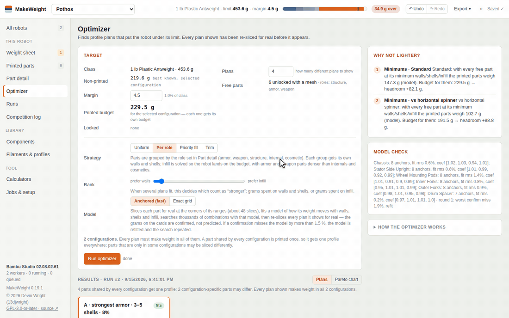

### Component library

Motors, ESCs, batteries, wheels — and fasteners with real specs. A fastener carries thread, length, head, drive, material
and finish (McMaster-style), gets a consistent label and a weight estimate from them, keeps a part number and link, and
can be duplicated to make the next length in one step. Lengths in inches can be typed as fractions (`5/16`, `1-1/4`).
Measured weights in the library propagate to every robot that uses the part, and the **Used** column shows which robots
carry it and how many.

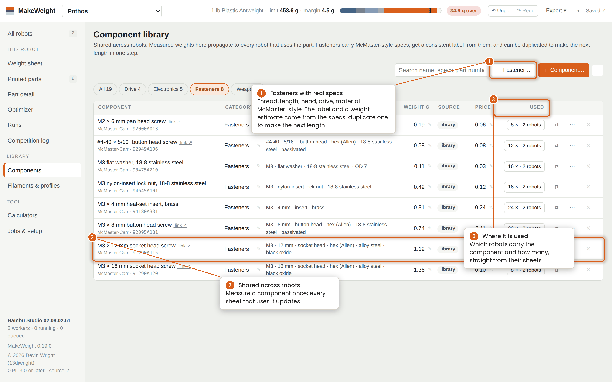

### Weigh-ins, calibration and the competition log

Enter the scale reading for a line after printing it (or for a whole assembly). Measured values replace estimates in the
total, the measured fraction of the robot's mass is shown on the sheet, and each weigh-in of a printed part refines that
filament's correction factor — the ratio of what your printer really puts down to what the slicer predicted — which is then
applied to every unweighed part on that filament. A weigh-in can record the profile the part was really printed with,
and the history of every weigh-in is editable. Whole-robot weigh-ins and the **Competition log** (event, placing, notes,
the sheet total at the time) keep the record of how the robot evolved.

## How the numbers work

Every printed-part estimate is a real slice: MakeWeight writes Bambu Studio's own machine, process and filament presets
with your profile's values on top, slices the oriented mesh headlessly, and reads the filament weight from the result.
Slices are cached by mesh, orientation, profile, filament and slicer version, so changing a part back to a setting you
tried before is instant. Each result carries the time it was sliced, and the Part detail page marks results that were
produced for the mesh the part has now (**✓ current mesh**) versus an earlier mesh (**older mesh**), so a stale number can
never pass for a current one.

Modifier regions (a box with its own walls and infill, e.g. 100 % around a bolt pattern) are sliced as real modifier
meshes. Scale and mirroring are applied before slicing. Filament correction factors come from your own weigh-ins, per
filament. The optimizer's model is only ever used to search; the grams on the plan cards are confirmed by re-slicing, and
if a confirmation misses the model by more than 1.5 % the model is refitted and the search repeated.

## Export to Bambu Studio

**Export → Bambu Studio project (.3mf)** builds a project with one plate per printed line, all copies of that line
arranged on it, and the walls / infill / supports written on each object, with the robot's filaments as the project
filament list. Plates are laid out exactly the way Bambu Studio spaces them, so the project opens with every part
centred on its own plate.

Part detail → **Printing** holds the print-prep options that travel with the part:

- **Supports** — normal or tree, overhang angle, build-plate-only, and a dedicated interface material such as Bambu
  Support For PLA. Choosing a dedicated interface applies the settings Bambu Studio recommends for it (independent
  support layer height off, rectilinear-interlaced interface, 0 mm interface spacing and top Z distance). The app also
  slices the part once more with supports to show how much filament and time they cost; the sheet still counts the part
  alone, since supports come off.
- **Prime tower** — a plate that prints two filaments (part plus interface material) gets Bambu's prime tower in the
  back-right corner; the copies on that plate are arranged clear of it, and supported parts are spaced further apart
  (12 mm, 20 mm for tree supports) so supports cannot run into a neighbour.
- **Mirrored** — reflects the part about X, Y or Z before slicing and exporting, so the 3MF needs no manual mirroring.
- **Mirrored pair** — a left/right pair on one sheet line (quantity 2): every other copy in the exported project is the
  mirror image about the bed's X or Y axis — same face down, same weight, no second part.

Other exports: the weight sheet as Excel or CSV in your layout, a purchase list, a printable print sheet, Bambu Studio
process presets as JSON, and a robot archive (`.makeweight.zip`) that another computer can import.

## Using it on more than one computer

Jobs & setup → **Use a shared folder…**: pick a folder inside a cloud drive (iCloud Drive, OneDrive, Dropbox, Google
Drive — the ones present on the machine are offered, and the folder picker marks any folder that already holds MakeWeight
data with a ✓). Choose **Move my data there** on the first computer and **Use the data already there** on each other one.
Robots, filaments, profiles and weigh-ins are then read from and written to that folder; the slicer install, caches and
machine-specific settings stay on each computer. Only one computer uses the data at a time: a copy that sits idle
(5 minutes by default, adjustable) releases it automatically, and another computer picks it up on its next action. If
the other computer is still busy you can **take over** — it pauses itself and shows a resume notice — so a machine left
running somewhere never blocks you. **Stop sharing** copies the data back to the computer.

## FAQ

**Which slicers does it use?** Bambu Studio is the reference: when it is the active engine there is no settings mapping —
the presets written for each slice are Bambu's own system presets with your profile's values on top, so the numbers match
what you see in Bambu Studio. PrusaSlicer is supported as an alternative engine.

**Does it need the internet?** Only to download the app, a slicer, and updates. Slicing, the sheet and everything else
run on your machine.

**Where is my data?** In your user data folder (see Install) or the shared folder you chose: a SQLite database, your
mesh files, backups and the slicer's work directory. **Jobs & setup → Back up now** writes a dated copy; a robot archive
carries a single robot, meshes included, to another install.

**Can I use my own print profiles?** Yes. Filaments & profiles holds walls, top/bottom layers, infill density and
pattern, layer height, line widths and more per profile; editing a profile re-slices every part that uses it, and the
optimizer creates profiles for the plans you apply.

**My part came back the wrong weight.** Check the orientation (the layer view shows what the slicer sees), the scale
(inch-unit exports are offered ×25.4 on import), and whether the slice is for the current mesh (the ✓ on the Part detail
page). Then weigh it — the correction factor learns from you.

## For maintainers

**Releasing.** Tag a commit `vX.Y.Z` and push the tag. GitHub Actions builds the four platform zips with
`build/make_dist.py`, stamps the version and repository into the app, and publishes a Release with the zips and the
installers. The in-app updater and the installers read releases from this repository.

**Renaming.** The name lives in `makeweight/brand.json` (`name`, `slug`, `tagline`, `legacy_names`). Edit it, move the old
name into `legacy_names`, run `python3 build/sync_brand.py`, commit. The UI, data directory, launchers, zip names, updater
and installers all follow; existing users' data is adopted from the old name's folder on first start.

**Layout.**

- `makeweight/` — the app (Python 3.12 standard library + numpy + openpyxl; vanilla JS front end)
- `build/make_dist.py` — packages an embedded Python runtime + wheels + app + launcher per platform
- `build/sync_brand.py` — pushes `brand.json` into the installers and this README's title
- `install.sh`, `install.ps1` — curl / irm installers that read the latest Release
- `docs/media/` — the screenshots and recordings on this page

## License

Copyright © 2026 Devin Wright (13djwright).

MakeWeight is free software: you can redistribute it and/or modify it under the terms of the GNU General Public
License as published by the Free Software Foundation, either version 3 of the License, or (at your option) any later
version — see [LICENSE](LICENSE). It is distributed in the hope that it will be useful, but WITHOUT ANY WARRANTY.
Every copy or derivative must keep this copyright notice and stay under the GPL. Bambu Studio and PrusaSlicer are
separate programs (AGPL-3.0, downloaded on first run), not part of this distribution.
